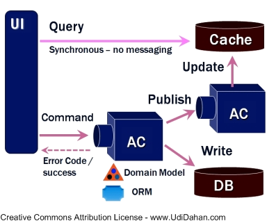

# CQRS

*Command-query responsibility segregation* (CQRS) is a pattern in system architecture inspired by *command query separation* (CQS).

It divides the system in two distinct parts:

- *commands*: components used for writing or update the *state* of an entity;
- *query*: component used for load the *state* of an entity.

CQRS is usually implemented using DDD and, as you can see in the preceding paragraph, the [event sourcing](event-sourcing.md) perfectly match the definition.

When a command comes in, the domain model calculates the new state of the system and possibly emits some new events (which are the only way the changes are persisted). When another command comes in for the same logical area, the domain model is restored from the past events, and responds to the new command by generating some new events. 

## Why CQRS?

There are many benefits on using CQRS, expecially in combination with ES and DDD:

- *business context mapping*: commands correspond to concrete user intents, and queries are designed to answer concrete questions;
- *higher level applicability*: CQRS is applicable on higher level of business (or boundary contexts);
- *scalability*: if business wants to collect reporting information about certain operations on the system and, since ES never loses information, CQRS structure helps to implement necessary commands;
- *performance*: different parts means different architecture. Read-only access is much easier to scale, as is the write side which doesn't care about queries anymore.

## References

- [Introduction to Event Sourcing and Command-Query Responsibility Segregation](http://squirrel.pl/blog/2015/08/31/introduction-to-event-sourcing-and-command-query-responsibility-segregation/) - Konrad Garus
- [Clarified CQRS](http://udidahan.com/wp-content/uploads/Clarified_CQRS.pdf) - Udi Dahan