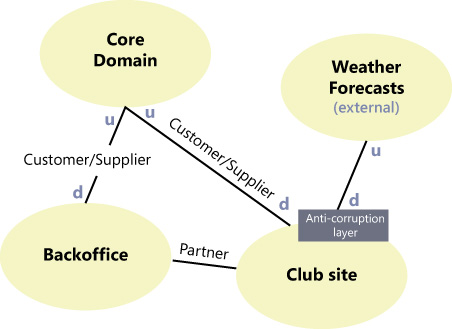

# Domain-driven design

Domain-Driven Design is a language and domain-centric approach to software design for complex problem domains.

It consists of a collection of patterns, principles and practices that will enable teams to focus on what is core to the success of the business while crafting software that manages complexity in both the technical and business spaces.

DDD shares a lot of things with OOP but reasoning is shifted on a business prospective.
OOP uses patterns to structure the entities, DDD uses models to satisfy use cases.

## Models

Using DDD means that technical decisions, like the persistence, user interfaces and messaging stuff, can come later.

Here, it’s the domain that needs to be understood.

A model is not a single view of the project, is not a diagram or set of diagrams. A model is not an entity binded with the code or with the tecnhology.

These are views of the model that differ from the model itself.

A **model** (or **domain model**) contains only what is relevant to solve problems in the context of the application being created. It needs to constantly evolve with to keep itself useful and valid in the face of new uses cases.

So a model is an abstraction of reality – not a reflection of real life - and exists in code, language, written documentation and diagrams.

This definition of a model gives the need to communicate using the same language. DDD advocates that the domain experts and developers consciously communicate using the concepts within the model.

## Ubiquitous language

Software projects fail due to poor communication and the overhead of translation between
domain and technical terminology.

A **ubiquitous language** minimizes the cost of translation and binds all expressions to the code model also known as the true model. A shared language also helps collaborative exploration when modelling, which can enable deep insights into the domain.

If an idea can’t easily be expressed then it indicates a concept that’s missing from the domain model and the team work together to figure out what that missing concept is.

### How create a language for the project?

The experts and developers work together to craft a model of the domain. Then, they use discussion with both consensus and compromise to achieve the very best Language for the project. 

The team never compromises on the quality of the Language, just on the best concepts, terms, and meanings. Initial consensus is not the end, however. The Language grows and changes over time as tiny and large breakthroughs are achieved, much like any other living language.

## Contexts

DDD calls a context the **bounded context** (BC).

Every domain model lives in precisely one bounded context and a bounded context contains precisely one domain model.

This definition may be confusing: if BCs are isomorphic to domain models, why introduce a new term?
Different systems (BCs) also interact with each other, sending files, passing messages, invoking APIs, etc. If we know there are two BCs interacting with each other, then we know we must take care to translate between the concepts in one domain and those of the other.

So, how BCs could interact with each other? DDD identifies a whole set of relationships between BCs, so that we can rationalize as to what we should do when we need to link our different BCs together:

- *published language*: the interacting BCs agree on a common a language (e.g. JSON, XML);
- *open host service*: a BC specifies a protocol (e.g. RESTful);
- *shared kernel*: two BCs use a common kernel of code (e.g. a library);
- *customer/supplier*: one BC uses the services of another and is a stakeholder (customer) of that other BC;
- *conformist*: one BC uses the services of another but is not a stakeholder to that other BC;
- *anti-corruption layer*: one BC uses the services of another and is not a stakeholder, but aims to minimize impact from changes in the BC it depends on by introducing a set of adapters.

We have maximum level of interaction between BCs with *published language* and minimum level of interaction with *anti-corruption layer* where an adapter or a set of adapters needs to be build to ensure contexts' communication.

### Context maps

Context maps are a visualisation of your highlevel strategy for solving the business problem.
They show the organisational and technical boundaries you believe will lead to the most effective solution for sustainably delivering value. 

There is no official notation for context maps, nor rules that govern them. You can visualise any information that highlights the relationship between domain, team, and technical boundaries. 

## References

- [The Anatomy of domain-driven design](https://leanpub.com/theanatomyofdomain-drivendesign) - Scott Millett
- [An Introduction to Domain Driven Design](http://www.methodsandtools.com/archive/archive.php?id=97) - Dan Haywood
- [Getting Started with Domain-Driven Design](http://www.informit.com/articles/article.aspx?p=1944876&seqNum=3) - Vaughn Vernon
- [The Strategic Practices of Domain-Driven Design](http://www.ntcoding.co.uk/workshops/strategic-ddd-practices) - Nick Tune