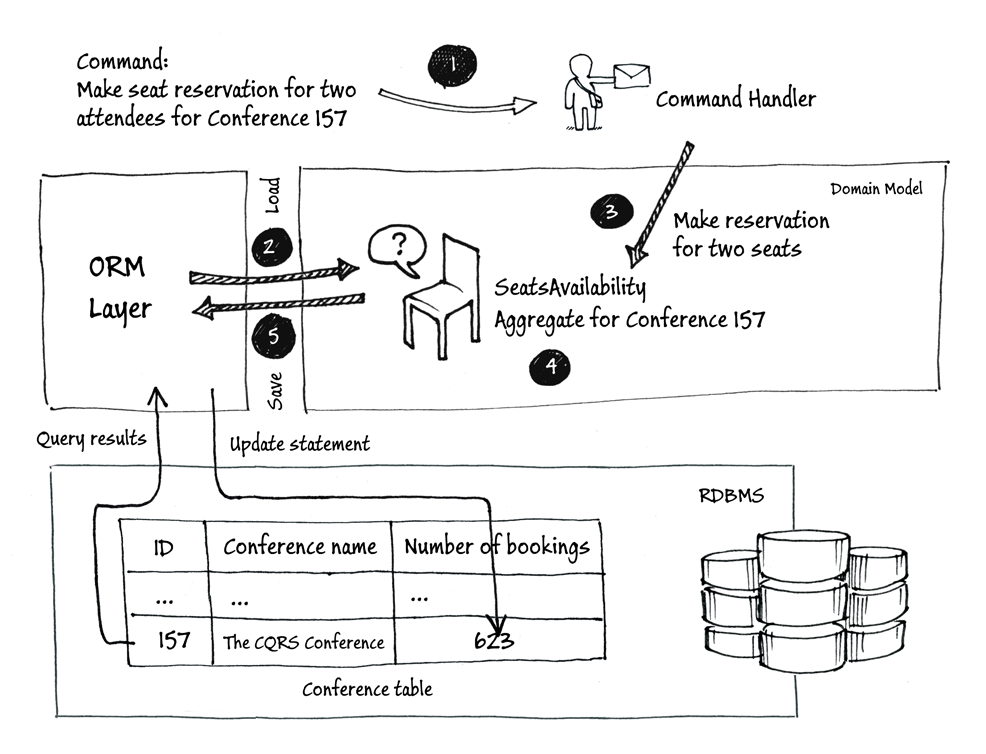

# Event sourcing

Event sourcing is a *pattern*, used in software projects, to atomically update state of an entity and publish events.

### The state

The traditional way to persist an entity is to save its current state. Event sourcing uses a radically different, event-centric approach to persistence. A business object is persisted by storing a sequence of state changing events. Whenever an object’s state changes, a new event is appended to the sequence of events. A entity’s current state is reconstructed by replaying its events.

Event sourcing can be used in DDD: **the *state* (generically associated with the entity) is the *state* of the *domain model***.

The state is never stored. It's always derived from the events' sequence.

### Events

An event is a piece of information stating that something has occurred (user created, name changed, shipping address added, order submitted, order delivered). They're always in past tense, saying that something has happened.

The events never change. You can never delete or update them. If something has happened, it's happened. If it was a mistake, it can be corrected with a complementary action generating a new *inverse* event, but there's no going back and saying it has not happened.

## Why event sourcing?

The most obvious thing we've gained by using Event Sourcing is that we now have a log of all the changes.
However this is a small gain. 

The key to Event Sourcing is that we guarantee that all changes to the domain objects are initiated by the event objects. This leads to a number of facilities that can be built on top of the event log:

- *Complete Rebuild*: we can discard the application state completely and rebuild it by re-running the events from the event log on an empty application;
- *Temporal Query*: we can determine the application state at any point in time (like a version control system) and we can consider multiple time-lines (analogous to branching).
- *Event Replay*: if we find a past event was incorrect, we can compute the consequences by reversing it and later events and then replaying the new event and later events.

## References

- [Event sourcing](http://eventuate.io/whyeventsourcing.html) - eventuate.io
- [Event sourcing](https://martinfowler.com/eaaDev/EventSourcing.html) - Martin Fowler
- [Introduction to Event Sourcing and Command-Query Responsibility Segregation](http://squirrel.pl/blog/2015/08/31/introduction-to-event-sourcing-and-command-query-responsibility-segregation/) - Konrad Garus