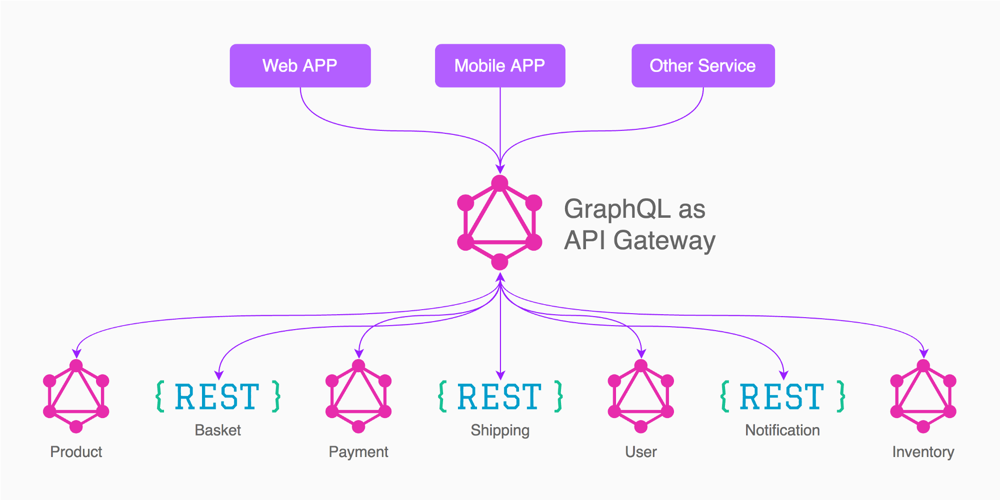

# Technology scouting

<!-- vscode-markdown-toc -->
* [Kafka](#Kafka)
	* [Resources](#Resources)
* [Zookeper](#Zookeper)
	* [Resources](#Resources-1)
* [Protobuf](#Protobuf)
	* [Resources](#Resources-1)
* [Axon](#Axon)
* [GraphQL](#GraphQL)
	* [Resources](#Resources-1)

<!-- vscode-markdown-toc-config
	numbering=false
	autoSave=true
	/vscode-markdown-toc-config -->
<!-- /vscode-markdown-toc -->

This document provides some (brief) descriptions about useful technologies for microservices implementation.

## Kafka

Apache Kafka is a community distributed event streaming platform capable of handling trillions of events a day. Initially conceived as a messaging queue, Kafka is based on an abstraction of a distributed commit log.

> This kind of technology is important in order to implement an event sourcing service.

### Resources

- [Official documentation](https://kafka.apache.org/)

## Zookeper

ZooKeeper is a distributed, open-source coordination service for distributed applications. It exposes a simple set of primitives that distributed applications can build upon to implement higher level services for synchronization, configuration maintenance, and groups and naming. It is designed to be easy to program to, and uses a data model styled after the familiar directory tree structure of file systems.

> This service is useful as a base for a microservices architecture. It handles some of main issues on coordination services implementation.

### Resources

- [Official documentation](https://zookeeper.apache.org/doc/current/zookeeperOver.html)

## Protobuf

Protobuf is a language-neutral, platform-neutral, extensible way of serializing structured data for use in communications protocols, data storage, and more.

> 

### Resources

- [Official repository](https://github.com/protocolbuffers/protobuf)
- [Developer guide](https://developers.google.com/protocol-buffers/docs/overview)

## Axon

Axon is a framework and server for event-driven microservices.

### References

[Reference guide](https://docs.axoniq.io/reference-guide/)

## GraphQL

GraphQL is a query language for your API, and a server-side runtime for executing queries by using a type system you define for your data.

> In the microservices context, this kind of technology is useful because it acts as a public API gateway, masquerading services API from public access.

### Resources

- [Official documentation](https://graphql.github.io/learn/)

